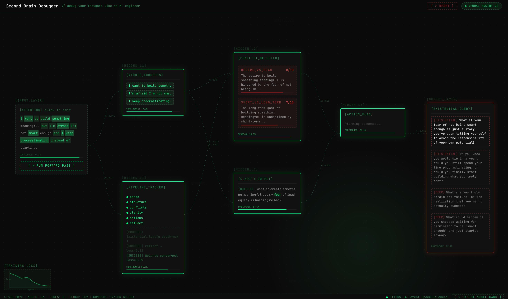

<div align="center">

# `SBD://` Second Brain Debugger

*because your biological neural network is throwing unhandled exceptions*

`v1.0.0` &nbsp;·&nbsp; `pipeline: armed` &nbsp;·&nbsp; `your thoughts: unoptimized`

[](https://your-deployment-url.vercel.app)
&nbsp;
[](https://nextjs.org)
&nbsp;

</div>

---

## The Incident Report

It's 2am. You open a notes app and type something like:

```
i want to build something meaningful but i keep procrastinating and maybe im
just not built for this and also i have 47 tabs open and three half-finished
projects and i told myself this year would be different but its april and—
```

Your notes app goes: *"Saved. ✨"*

Your therapist goes: *"Mmm. And how does that make you feel?"*

Your brain goes: *[SEGMENTATION FAULT]*

**Second Brain Debugger goes:** hold on. let me run that through the pipeline.

Six stages. Real AI. Your actual thoughts — parsed, structured, conflict-detected, clarified, actioned, and reflected back at you like a senior engineer just reviewed your brain's pull request.

No affirmations. No breathing exercises. Just a stack trace of your own mind — and a patch.

---

## Demo

**Complete Pipeline**
All six stages green. Existential queries loaded. Training loss converged. `STATUS: Latent Space Balanced`.



**Export Model Card**
The full debug report: conflicts, clarity score, tension peak, convergence epoch, recommended actions, existential queries. Formatted as an ML inference report — because that's exactly what it is.


---

## How The Pipeline Works

> *Each stage feeds the next. Stage 5 doesn't generate generic actions — it generates actions specific to **your** conflicts from Stage 3. This is contextual chaining. Your thoughts aren't processed. They're compiled.*

```
                    YOUR BRAIN (legacy, poorly documented)
                               │
                               ▼
              ┌────────────────────────────────┐
              │  [01] PARSE                    │
              │  Input: raw stream of anxiety  │
              │  Output: atomic thoughts       │
              │  Model: mistral-7b (fast)      │
              └──────────────┬─────────────────┘
                             │  clean signal
                             ▼
              ┌────────────────────────────────┐
              │  [02] STRUCTURE                │
              │  Builds the dependency graph   │
              │  your brain refused to make    │
              └──────────────┬─────────────────┘
                             │  relationships mapped
                             ▼
              ┌────────────────────────────────┐
              │  [03] CONFLICTS          ⚠️    │
              │  Detects cognitive dissonance  │
              │  Scores it. Names it. Ouch.    │
              │  e.g. "Ambition vs. Imposter   │
              │  Syndrome — severity: 0.87"    │
              └──────────────┬─────────────────┘
                             │  [900ms tension pause]
                             ▼
              ┌────────────────────────────────┐
              │  [04] CLARITY            💡    │
              │  Distills the core truth.      │
              │  Also: what you're avoiding.   │
              │  The uncomfortable part.       │
              └──────────────┬─────────────────┘
                             │  typewriter effect kicks in
                             ▼
              ┌────────────────────────────────┐
              │  [05] ACTIONS                  │
              │  Concrete. Low-energy. Linked  │
              │  to YOUR specific conflicts.   │
              │  Not a 47-item todo list.      │
              └──────────────┬─────────────────┘
                             │
                             ▼
              ┌────────────────────────────────┐
              │  [06] REFLECT            🌀    │
              │  Existential queries based on  │
              │  your latent space analysis.   │
              │  The part that hits different  │
              │  at 2am. You've been warned.   │
              └──────────────┬─────────────────┘
                             │
                             ▼
                    YOU, BUT DEBUGGED
```

Everything streams live over SSE. You don't wait for results. You watch your brain get analyzed in real time — stage by stage — like a compiler running passes on your own cognition.

---

## The Stack

```js
const SBD = {
  framework:   "Next.js 14 (App Router) + TypeScript",
  styling:     "Tailwind CSS + custom design tokens",
                // yes, both. it made sense at 2am. it still makes sense.
  animations:  [
    "Framer Motion",          // UI transitions
    "Canvas API",             // Matrix-style Token Rain background
    "SVG Neural Edges",       // paths connecting cards with live weights (w: 0.84)
  ],
  ai: {
    provider:     "Oxlo API",
    fast_model:   "mistral-7b",    // Stage 1: parse fast, think later
    strong_model: "mixtral-8x7b",  // Stages 2-6: actually think
  },
  validation:  "Zod — every stage, every response, no exceptions",
  state:       "useReducer state machine",
               // idle → parsing → structuring → detecting →
               // clarifying → planning → reflecting → done
               // useState would have been a crime scene
  runtime:     "Vercel Edge",      // cold starts are the enemy
  streaming:   "SSE end-to-end",   // you see it as it thinks
}
```

---

## The Design System: *NSA Meets Notion*

Brutalist. Terminal. Hacker-green. Every pixel earned its place.

```css
--bg:      #0a0a0a;                    /* the void */
--accent:  #00ff88;                    /* the only color that matters */
--border:  1px dashed rgba(0,255,136,0.3);
--font:    'JetBrains Mono', monospace; /* ALL AI output. non-negotiable. */
```

| Component | What it does | Why it exists |
|-----------|-------------|---------------|
| `EEGOscilloscope` | Live brainwave monitor | It moves because the model is thinking. Not decoration. |
| `AttentionHeatmap` | Highlights keywords as you type | You see what the AI will focus on *before* it does |
| `NeuralEdges` | SVG paths connecting UI cards | Shows live weights `w: 0.84` + backprop animations on conflict |
| `CognitiveFingerprint` | Unique signature per session | Every debug session is different. So is yours. |
| `ModelCard` | Final output as ML inference report | Because that's exactly what it is |

---

## Architecture: The Three Decisions That Matter

**1. Why 6 separate API routes and not one giant prompt?**

Because each stage validates its output with Zod before the next stage touches it. Stage 3 (Conflicts) is reasoning on top of *guaranteed clean data* from Stage 2. One big prompt gives you one big guess. The pipeline gives you six verified passes.

**2. Why Edge Runtime?**

The first character of Stage 1 output should appear in under a second. Edge eliminates cold starts. Combined with SSE, users see real output before Stage 2 has even initialized. Latency is a UX decision.

**3. Why `useReducer` and not `useState`?**

Six stages. Eight possible states. Concurrent streaming updates. Error recovery paths. `useState` for this would look like a commit message that says "fixed stuff." The reducer makes every state transition explicit, traceable, and — fitting for a debugger — debuggable.

---

## The 900ms Pause

After Stage 4 (Clarity) resolves, the UI holds for 900 milliseconds before the output renders.

That is not a slow API. That is not a bug. That is a deliberate design choice.

The silence before something true lands harder than if it just appeared. `triggerImpactMoment()` fires once — guarded by a `useRef` because firing it twice would break the spell — and then the typewriter takes over.

Some UX decisions are measured in milliseconds. This one is.

---

## Running It Locally

```bash
git clone https://github.com/TryingtobeingNikhil/Second-Brain-Debugger
cd Second-Brain-Debugger
npm install
```

```env
# .env.local — don't commit this. obviously.
OXLO_API_KEY=your_key_here
OXLO_BASE_URL=https://api.oxlo.ai/v1
OXLO_FAST_MODEL=mistral-7b
OXLO_STRONG_MODEL=mixtral-8x7b
```

```bash
npm run dev
# → localhost:3000
```

Open it. Type something you've been avoiding thinking about.

See what the pipeline finds.

---

## Project Structure

```
app/
  api/analyze/
    parse/        ← Stage 1: fast model, strips the noise
    structure/    ← Stage 2: builds the dependency graph
    conflicts/    ← Stage 3: finds where you contradict yourself
    clarity/      ← Stage 4: the honest part
    actions/      ← Stage 5: what you actually do next
    reflect/      ← Stage 6: questions you didn't know to ask
  page.tsx        ← the terminal. where it all happens.

components/ui/
  PipelineTracker.tsx      ← always visible. always watching.
  EEGOscilloscope.tsx      ← the brain is working
  AttentionHeatmap.tsx     ← the brain is watching
  CognitiveFingerprint.tsx ← your session's unique signature
  ActionStep.tsx           ← one patch at a time

lib/ai/
  pipeline.ts   ← AsyncGenerator. the spine of everything.
  schemas.ts    ← Zod contracts for all 6 stages
  prompts.ts    ← system prompts + model config
  stream.ts     ← SSE utilities
  parser.ts     ← safeParseJSON. because AI hallucinates structure.
  retry.ts      ← withRetry: 2 attempts, 30s timeout, exponential backoff

lib/
  validation.ts     ← sanitize input, cap at 5000 chars
  observability.ts  ← knows when things are about to go wrong

middleware.ts   ← rate limit: 10 req/min per IP
                   (be reasonable. this isn't a thought farm.)
```

---

## License

MIT.

Your thoughts are yours. The debugger is free. The existential crisis is complimentary.

---

<div align="center">

```
> session complete
> conflicts resolved:          3
> actions generated:           5  
> existential questions:       ∞
> biological neural network:   still running legacy code
>
> but at least now you have the stack trace.
>
> — SBD v1.0.0
```

*built with too much coffee and just enough clarity*

</div>
